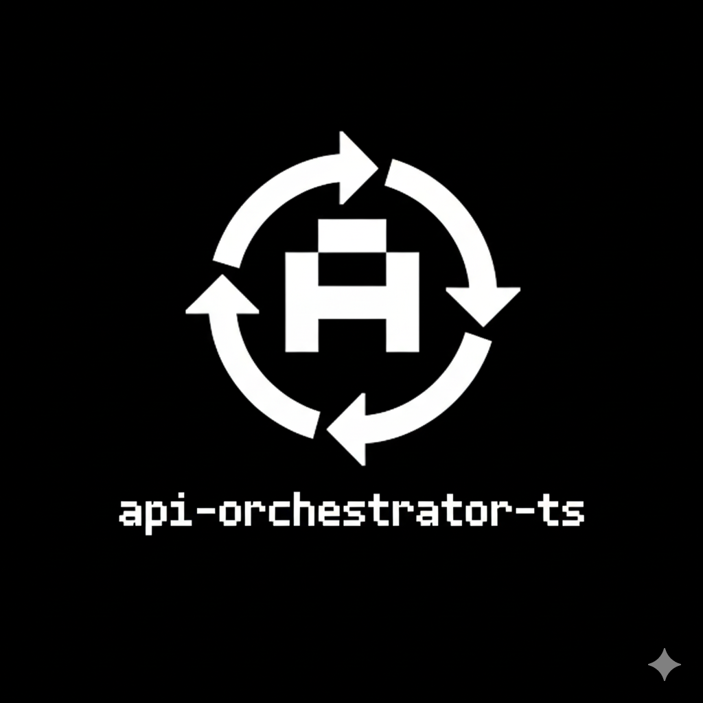

# API Orchestrator TS



[](https://www.typescriptlang.org/) [](https://nodejs.org/) [](./__tests__) [](LICENSE)

Production-ready API Orchestrator for TypeScript inspired by Temporal, Step Functions, and modern resilience patterns. It ships retries with backoff + jitter, smart throttling, adaptive concurrency, rate-limit awareness, auth refresh, plugin hooks, observability, and a self-updating context.

## Highlights

- Sequential & burst-parallel execution with a smart throttle (PQueue-based)
- Resilience: retries, exponential backoff, jitter, fallbacks, failure classification
- Advanced timeouts with AbortController + Promise.race + late cancellation
- Rate-limit intelligence: auto wait/resume on 429/Retry-After/X-RateLimit headers
- Plugin system: logging, metrics, Stripe sample; fully typed lifecycle hooks
- Observability: internal event bus, durations, retries used, rate-limit hits
- Smart context: namespaced, collision-checked, frozen per-step snapshots

## Installation

```bash
npm install
npm run build
```

## Quick Start

```ts
import { orchestrate, createStep, loggingPlugin } from 'api-orchestrator-ts';

const steps = [
  createStep('auth', async () => ({ token: 'tkn' })),
  createStep('fetchData', async ({ get }) => {
    const auth = get<{ token: string }>('auth');
    return { data: `hello ${auth?.token}` };
  }),
];

const result = await orchestrate(steps, {
  retries: 2,
  timeout: 5_000,
  plugins: [loggingPlugin()],
});

console.log(result.success, result.results);
```

## API Surface

- `orchestrate(steps, config?)` — run sequential/parallel workflows with resilience
- `createStep(name, execute, options?)` — build typed steps with optional timeout, retries, fallback, parallel flag
- `SmartThrottle` — PQueue wrapper with adaptive concurrency and pauses
- Built-in plugins: `loggingPlugin`, `createMetricsPlugin`, `stripePlugin`
- Types: `StepConfig`, `OrchestrateConfig`, `OrchestrateResult`, `OrchestrateError`

### Step definition

```ts
const step = createStep(
  'fetchUser',
  async ({ signal, attempt }) => {
    const res = await fetch('https://api.example.com/user', { signal });
    if (!res.ok) throw new Error('fetch failed');
    return res.json();
  },
  {
    retries: 2,
    timeout: 1500,
    fallbackValue: { id: 'anon' },
    parallel: false,
  },
);
```

### Config (selected)

- `timeout` (ms) — default step timeout
- `retries`, `delay`, `backoffFactor`, `maxDelay`, `jitter`
- `authRefresh(context)` — invoked once on a 401, then the step is retried
- `throttle: { concurrency, perSecond, adaptive }`
- `plugins: OrchestratorPlugin[]`

### Result shape

```ts
{
  success: boolean;
  results: Record<string, unknown>;
  errors?: OrchestrateError[];
  getEvents: () => TelemetryEvent[];
}
```

## Examples

- `npm run example:basic` — minimal sequential pipeline
- `npm run example:parallel` — concurrent batches with throttling
- `npm run example:timeout` — timeout + fallback
- `npm run example:fallback` — graceful degradation on failure
- `npm run example:full` — plugins, rate-limit detection, adaptive queue

## Plugin Hooks

- `beforeStart`, `beforeStep`, `afterStep`, `onRetry`, `onTimeout`, `onRateLimit`, `onError`, `afterEnd`

Each hook receives a typed context (`step`, `attempt`, `error`, `rateLimit`, `timeoutMs`, `events`, `contextSnapshot`).

## Architecture Overview

- **Core**: `orchestrate` drives execution groups (sequential by default, grouped parallel steps) and pushes work through `SmartThrottle`.
- **Context Engine**: immutable, namespaced step data with collision checks; plugins see read-only snapshots.
- **Resilience Engine**: retry policy with exponential backoff + jitter, failure classification, auth refresh on 401, fallbacks per step.
- **Timeout Engine**: per-step timer with `AbortController`, Promise.race, and late-response cancellation.
- **Rate Limit Intelligence**: inspects status/headers (`429`, `Retry-After`, `X-RateLimit-*`), pauses queue, waits, resumes, and notifies plugins.
- **Observability**: `EventBus` captures lifecycle events; `getEvents()` returns a visualization-friendly array.

## Troubleshooting

- **Steps never run**: ensure `orchestrate` is awaited; it is async.
- **Colliding context keys**: rename steps or use namespaces (`payments.capture`).
- **Timeout too eager**: raise `timeout` in config or per step.
- **Rate limits**: ensure APIs return `Retry-After`/`429`; throttle will auto-wait but you can increase `perSecond`.
- **Auth refresh not firing**: the step must throw with `status === 401` or `response.status === 401`.

## Extension Ideas

- OpenTelemetry tracer plugin
- Circuit-breaker plugin on top of retries
- Persistent state adapter (Redis/SQL) for long-running workflows
- UI timeline viewer built from `getEvents()`

## Development

```bash
npm install
npm test
npm run build
```

## License

MIT © Robi Kas

## Support

- Star the repository to show support
- Report issues or feature requests on GitHub
- Follow on X: @robi_kass
- Contact contributions and bug reports via GitHub issues.

